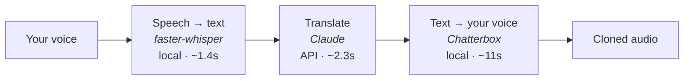

# echo

Speak a sentence in English, hear it back in another language — **in your own voice**.

A learning prototype. Everything except the translation runs locally on your own machine, and no model is ever trained on your voice.

  

---

## How it works

Three stages chained together:



**Nothing is trained.** Chatterbox does *zero-shot* voice cloning: your reference recording is passed in as an input on every generation, the way you'd hand a reference image to an image model. The model weights never change and never learn anything about you. Swap `reference.wav` and the next sentence uses the new voice immediately.

**Why Claude for the middle step.** Speech recognition faithfully transcribes disfluencies, so the input to translation looks like *"um so I was I was thinking maybe we could meet on Tuesday instead"*. Claude is instructed to clean that up and translate idiomatically, producing *"Я тут подумал, может, встретимся лучше во вторник?"* rather than a literal rendering complete with the stutter.

---

## Requirements

- **macOS on Apple Silicon.** It runs on CPU elsewhere, but roughly 2× slower.
- **Python 3.11** (Chatterbox is developed and tested against it).
- **ffmpeg** — `brew install ffmpeg`.
- **An Anthropic API key.** Translation costs about **$0.0015 per sentence**, so $5 covers a few thousand.
- About **3GB of disk** for model weights, downloaded on first run.

---

## Setup

```bash
git clone <this repo> && cd whisper-t

# Python 3.11 environment
uv venv --python 3.11 .venv          # or: python3.11 -m venv .venv
VIRTUAL_ENV=.venv uv pip install -r requirements.txt

# Your API key
cp .env.example .env                  # then paste your key into .env
.venv/bin/python check_key.py         # verifies it works, without printing it
```

### Record your reference voice

The clone is only as good as this clip, and **recording level matters more than microphone quality**. A phone voice memo at a healthy level beats a laptop mic at a quiet one — in testing, a MacBook recording came in 20dB quieter than an iPhone one and cloned noticeably worse.

```bash
./record_voice.sh                     # 20s from the Mac mic, with a level check
./use_recording.sh ~/voice.m4a        # or convert anything you already have
```

Aim for 15–20 seconds of continuous, natural speech in a quiet room without echo. The words don't matter — nothing is being trained on them.

### Run it

```bash
.venv/bin/python server.py            # ~1 minute to load models, then open localhost:8000
```

Hold the button, say **one sentence**, release.

---

## Performance

Measured on an M3 MacBook Air, short sentence:

| Stage | Time | Where |
|---|---|---|
| Speech → text | 1.4s | local (CPU) |
| Translate | 2.3s | Anthropic API |
| Voice generation | 11.4s | local (Apple GPU) |
| **Total** | **~15s** | |

Generation time scales with how much you say, and **badly** — a full paragraph took 102 seconds. The interface pushes you toward single sentences with a live length meter, and caps recordings at 30 seconds.

The model is warmed up at startup with a throwaway generation, because the first run after loading is roughly 4× slower than the rest.

---

## Limitations

- **Not real-time.** Press, speak, release, wait. Simultaneous interpretation is a substantially harder problem.
- **Your accent is the model's, not yours.** Cross-lingual cloning transfers vocal timbre convincingly, but prosody comes from the model. It sounds recognisably like you speaking with a slight accent.
- **English input only.** `small.en` is English-only; switch `WHISPER_MODEL` in `pipeline.py` to `large-v3-turbo` for multilingual input at roughly 8× the transcription cost.
- **Russian stress marks are missing.** Chatterbox wants an optional `russian_text_stresser` package that isn't on PyPI, so stress placement is guessed. Occasionally audible — *кофе* can drift toward *кафе*.
- **Saving to a chosen folder needs Chrome or Edge.** It uses the File System Access API for a real save dialog; other browsers fall back to an ordinary download.

---

## Languages

All 22 target languages the voice model supports are enabled:

> Arabic · Chinese · Danish · Dutch · Finnish · French · German · Greek · Hebrew · Hindi · Italian · Japanese · Korean · Malay · Norwegian · Polish · Portuguese · Russian · Spanish · Swahili · Swedish · Turkish

**The voice model is the constraint, not the translation.** Claude translates into far more languages than this; Chatterbox can only *speak* these 23 (the 22 above plus English, the source).

Spot-checked end to end by translating, generating, then transcribing the audio back — Polish, Hindi, Arabic and Swedish all round-tripped accurately, so non-Latin scripts and right-to-left text are fine.

To change the list, edit `LANGUAGES` in `pipeline.py` — one line each. The key is the code Chatterbox knows, the value is the name Claude translates into:

```python
LANGUAGES = {
    "pl": "Polish",
}
```

To see every code the installed model accepts:

```bash
.venv/bin/python -c "from chatterbox.mtl_tts import SUPPORTED_LANGUAGES; print(SUPPORTED_LANGUAGES)"
```

---

## Layout

```
pipeline.py      The three stages. Loads models once, keeps them warm.
server.py        FastAPI. Streams progress per stage as NDJSON.
index.html       The interface — one file, no build step.
check_key.py     Verifies your API key without printing it.
smoke_test.py    Proves voice cloning works before you build on it.
*.dc.html        Design source for the seven interface states.
canvas.json      Layout for those design artboards.
```

Progress in the UI is **real**, not a timer: the server emits an event as each stage completes, and the page renders what it receives.

---

## Two bugs worth knowing about

Both were found during development and are fixed here, but they're the kind that recur:

**Whisper invents words from silence.** Four seconds of silence and a pure 220Hz tone both transcribed as `"You"` — which would then be translated and spoken in your cloned voice as though you'd said it. Fixed by enabling voice-activity detection, which strips non-speech before transcription.

**A press that hides its own button never gets a release.** The mic button lived on a screen that gets hidden the moment recording starts, so `pointerup` bound to the button never fired and recording ran forever. Release is now watched on the window.

---

## Licence & credits

Prototype code — do what you like with it.

Built on [Chatterbox](https://github.com/resemble-ai/chatterbox) (MIT, Resemble AI), [faster-whisper](https://github.com/SYSTRAN/faster-whisper), and the [Anthropic API](https://docs.anthropic.com).

**Only clone your own voice, or a voice you have explicit permission to use.**
