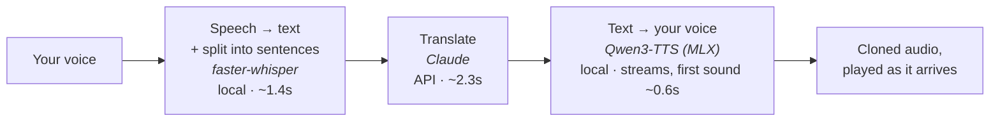

# echo

Speak in English, hear it back in another language — **in your own voice**.

A learning prototype. Everything except the translation runs locally on your own machine, and no model is ever trained on your voice.

> **This is echo v2.** The voice model is **Qwen3-TTS on Apple's MLX runtime**, and the whole message is voiced as **one stream** that starts playing within about half a second of generation starting ([ADR-0010](docs/adr/0010-qwen3-tts-on-mlx-for-voice-cloning.md), [ADR-0012](docs/adr/0012-stream-one-generation-per-message.md)). First sound arrives in about 5–6 seconds, with no change of voice between sentences. It speaks 9 languages. **v1**, with Chatterbox and 22 languages, is kept under the tag [`v1-chatterbox`](../../tree/v1-chatterbox): `git switch --detach v1-chatterbox`, then run it with the Python 3.11 `.venv` from its own README.

  

---

## How it works

Three stages chained together:


```mermaid
flowchart LR
    A[Your voice] --> B["Speech → text<br/>+ split into sentences<br/><i>faster-whisper</i><br/>local · ~1.4s"]
    B --> C["Translate<br/><i>Claude</i><br/>API · ~2.3s"]
    C --> D["Text → your voice<br/><i>Qwen3-TTS (MLX)</i><br/>local · streams, first sound ~0.6s"]
    D --> E[Cloned audio,<br/>played as it arrives]
```

**Nothing is trained.** Qwen3-TTS does *zero-shot* voice cloning: your reference recording is passed in as an input on every generation, the way you'd hand a reference image to an image model. The model weights never change and never learn anything about you.

It also needs a transcript of that recording. echo makes one with Whisper the first time it starts and saves it as `reference.txt`, next to the audio. Re-record `reference.wav` and the transcript is rebuilt automatically on the next start.

**Why Claude for the middle step.** Speech recognition faithfully transcribes disfluencies, so the input to translation looks like *"um so I was I was thinking maybe we could meet on Tuesday instead"*. Claude is instructed to clean that up and translate idiomatically, producing *"Я тут подумал, может, встретимся лучше во вторник?"* rather than a literal rendering complete with the stutter.

---

## Requirements

- **macOS on Apple Silicon.** It runs on CPU elsewhere, but roughly 2× slower.
- **Apple Silicon.** MLX is Apple's own runtime and only runs on M-series Macs.
- **Python 3.12.**
- **ffmpeg** — `brew install ffmpeg`.
- **An Anthropic API key.** Translation costs about **$0.0015 per sentence**, so $5 covers a few thousand.
- About **5GB of disk**: ~2.7GB for the voice model, downloaded on first run, plus PyTorch for the watermark.

---

## Setup

```bash
git clone <this repo> && cd whisper-t

# Python 3.12 environment. Named .venv-mlx so it can sit beside v1's
# .venv — the two voice libraries can't share one (ADR-0010).
uv venv --python 3.12 .venv-mlx
uv pip install --python .venv-mlx/bin/python -r requirements.txt

# Your API key
cp .env.example .env                  # then paste your key into .env
.venv-mlx/bin/python check_key.py     # verifies it works, without printing it
```

### Record your reference voice

The clone is only as good as this clip, and **recording level matters more than microphone quality**. A phone voice memo at a healthy level beats a laptop mic at a quiet one — in testing, a MacBook recording came in 20dB quieter than an iPhone one and cloned noticeably worse.

```bash
./record_voice.sh                     # 20s from the Mac mic, with a level check
./use_recording.sh ~/voice.m4a        # or convert anything you already have
```

Aim for 15–20 seconds of continuous, natural speech in a quiet room without echo. The words don't matter — nothing is being trained on them.

### Run it

```bash
.venv-mlx/bin/python server.py        # ~15s to load (first run also downloads ~2.7GB), then open localhost:8000
```

Tap the microphone, speak, tap **Stop and translate**.

You can say several sentences. Each is translated on its own and shown
on its own row, but the voice is generated as **one stream for the whole
message** and starts playing while the rest is still being made. The
sentence being spoken is highlighted; tap any sentence to play from there.

---

## Performance

Measured on an M3 MacBook Air, the same three-sentence Russian recording
(a 17-second reference clip, 16.6 s of translated speech) through each
version:

| | First sound | Voice fully generated |
|---|---|---|
| v1: Chatterbox, one sentence at a time | 21.6s | 49.6s |
| Qwen3-TTS, one sentence at a time | 9.9s | 17.8s |
| **v2: Qwen3-TTS, one stream per message** | **~6.0s** | **16.4s** |

Of that ~6 seconds, about 2.5 s is speech-to-text, 2 s is translation (all
sentences at once), 0.8 s is the voice model's first audio, and 0.6 s is a
safety buffer in the page. Speech to text and translation are now the
biggest waits. Qwen3-TTS generates speech 1.1–1.4x faster than it plays;
Chatterbox ran at about 0.5x.

On a short three-sentence message, the page measured first sound at
4.8–5.2 s.

Russian word accuracy is roughly the same: transcribing the generated
speech back with a multilingual Whisper, 6% of words weren't heard as
intended with Qwen3-TTS, against 5% with Chatterbox.

The figures below were measured on v1, with Chatterbox. They explain
why speech was split into sentences in the first place. Streaming made the
split unnecessary for speed, and generating sentences separately made each
one sound like a slightly different speaker (ADR-0012).

| | First audio | All finished |
|---|---|---|
| one long clip | 89.6s | 89.6s |
| sentence at a time | **21.6s** | 49.6s |

Chunking is 4.3x faster to first sound here, and 1.8x faster overall —
three short generations beat one long one, because long inputs make the
voice model degrade (sampling slows from ~15 to ~1 tokens/sec and it can
force an early stop on repetition).

**That figure depends on what you say.** Chunking stops later sentences
queuing behind earlier ones; it does nothing to make any single sentence
faster. A two-sentence recording measured closer to 2x, and one short
sentence gains nothing at all, because the first sentence still takes its
full ~12s to generate either way.

Voice generation is never parallelised: one Chatterbox model on one GPU
deadlocked when called from several threads. There's one generation per
message now, and a lock stops two requests (two tabs, say) from ever
running the model at once. Translations do run concurrently, since they're
just network calls.

**Playback is gapless.** Audio arrives in ~0.3 s pieces, and the page
schedules each one to start on the exact sample where the last one ends.
Rendered offline, the output matched the source to within floating-point
rounding. If generation ever falls behind playback (a long message on a
busy fanless laptop), the page shows "buffering…" for half a second
instead of stuttering.

Recordings are capped at 30 seconds, and speech with no full stop is
broken at the last comma so a rambling sentence can't stall the queue.

The models are warmed up at startup with a throwaway generation, because
the first run after loading is roughly 4x slower than the rest.

---

## Saved clips

Every translation is written to a local `history/` folder automatically —
audio plus a JSON sidecar with what you said, what it became, and how long
it took. The clock icon in the header opens them, newest first.

This exists so you can compare after the fact: the same sentence in Russian
and Japanese, side by side, without having to decide in advance that you'd
want to.

The **server** does this, not the browser. A web page can't read a folder
from disk without a directory-handle permission dance that doesn't survive
between sessions; the server is a local process with ordinary file access.

**These are recordings of your voice and transcripts of everything you've
said.** `history/` is gitignored — including the `.json` sidecars, which are
text and would otherwise sail past the audio rules. Delete any clip from the
list, or empty the folder.

The **Save** button is a different thing and still there: it exports the
current translation to a folder you pick, for taking elsewhere.

---

## Limitations

- **Not real-time.** Tap, speak, tap, wait about five seconds. The voice streams once it starts, but translating *while* you speak, like a live interpreter, is a substantially harder problem.
- **The highlight is approximate.** One audio stream has no sentence markers, so which sentence is lit is estimated from the length of its text. It's usually right, but can be off by a fraction of a second.
- **Your accent is the model's, not yours.** Cross-lingual cloning transfers vocal timbre convincingly, but prosody comes from the model. It sounds recognisably like you speaking with a slight accent.
- **English input only.** `small.en` is English-only; switch `WHISPER_MODEL` in `pipeline.py` to `large-v3-turbo` for multilingual input at roughly 8× the transcription cost.
- **Nine languages, not 22.** See below.
- **Occasional nonsense.** In testing, one clip in eighteen slid into English-sounding syllables halfway through a Russian sentence. Streaming generation, which echo uses, didn't do it in that sample, but the sample was small.
- **Saving to a chosen folder needs Chrome or Edge.** It uses the File System Access API for a real save dialog; other browsers fall back to an ordinary download.

---

## Languages

All nine target languages the voice model supports are enabled:

> Chinese · French · German · Italian · Japanese · Korean · Portuguese · Russian · Spanish

**The voice model is the constraint, not the translation.** Claude translates into far more languages than this; Qwen3-TTS can only *speak* these nine plus English, the source.

Compared with v1, v2 drops Arabic, Danish, Dutch, Finnish, Greek, Hebrew, Hindi, Malay, Norwegian, Polish, Swahili, Swedish and Turkish. Use the `v1-chatterbox` tag for those.

To change the list, edit `LANGUAGES` in `pipeline.py`. The key is a short code used in URLs and filenames; the value is the name Claude translates into, and lowercased, the name the voice model expects. The server checks every entry against the model at startup and refuses to start if one isn't supported.

```python
LANGUAGES = {
    "ru": "Russian",
}
```

---

## Layout

```
pipeline.py      The three stages. Loads models once, keeps them warm.
server.py        FastAPI. Streams progress events, then the voice as ~0.3s audio pieces.
index.html       The interface — one file, no build step.
history/         Saved clips (gitignored — your voice, your transcripts).
check_key.py     Verifies your API key without printing it.
chunk_test.py    Shows how a recording splits into sentences.
test_buffer.py   Unit tests for sentence chunking — no models, runs instantly.
bench_streaming.py  Measures chunked vs one-clip generation (either engine).
smoke_test.py    v1 (Chatterbox) only — run from the v1-chatterbox tag.
bench.py         v1 (Chatterbox) only — run from the v1-chatterbox tag.
*.dc.html        Design source for the seven interface states.
canvas.json      Layout for those design artboards.
```

Progress in the UI is **real**, not a timer: the server emits an event as each stage completes, then streams the voice in pieces, and the page plays them as they arrive.

---

## Things that bit us

All fixed here, but they're the kind that recur:

**Whisper invents words from silence.** Four seconds of silence and a pure 220Hz tone both transcribed as `"You"` — which would then be translated and spoken in your cloned voice as though you'd said it. Fixed by enabling voice-activity detection, which strips non-speech before transcription.

**A press that hides its own button never gets a release.** The mic button lived on a screen that gets hidden the moment recording starts, so `pointerup` bound to the button never fired and recording ran forever. Release is now watched on the window rather than the button.

**One voice model can't be shared across threads.** Generating three sentences in parallel deadlocked outright — CPU flat at 0%, no progress, had to be killed. Voice generation queues; only the translations run concurrently.

**faster-whisper isn't usefully lazy.** `transcribe()` returns a generator in 0.07s, which looks like streaming, but the first `next()` does all the work — all segments land at the same instant. Whisper works in 30-second windows, so anything shorter is one atomic pass. Chunking helps *after* transcription, not during it.

**Not every WAV is integer PCM.** The voice model writes 32-bit *float* WAVs (format tag 3). Python's `wave` module refuses those outright ("unknown format: 3"), and a joiner that hardcodes tag 1 in its output header produces a file whose header contradicts its contents — which plays as noise. Both joiners now read the tag from the source. Synthetic 16-bit test files hide this completely.

**A library can hide its own missing parts.** The watermark library imports six packages it never declares, and when one is missing it reports `'NoneType' object is not callable` instead of the real error. It happened twice, a month apart: first `pkg_resources`, then `librosa`. Every one is now pinned by hand in `requirements.txt`, and the watermark is checked with its own detector rather than trusted because nothing crashed.

**Watermarking in pieces clicks.** The watermark treats the start and end of whatever it's given slightly differently, so marking each 0.3-second streaming piece on its own made every join a tiny step: a faint tick three times a second. Each piece is now marked together with the audio just before it, and passes are crossfaded over 20 ms. The joins then measure identically to watermarking the whole clip at once.

**Hidden tabs don't animate.** Browsers slow or pause `requestAnimationFrame` for tabs that aren't visible, so a highlight driven only by animation frames lagged behind taps. The transport now redraws the moment you act, and uses frames only for smooth motion.

**Sentence boundaries don't come from silence.** Neither VAD pauses nor Whisper's own segment timestamps line up with sentences — both split mid-sentence. The transcript's punctuation is the only reliable boundary, so text is buffered until it ends in `.`, `?` or `!`.

---

## Responsible use

**Only clone your own voice, or one you have explicit permission to use.**

**echo only speaks what was just said.** There is no way to type text and hear it in the cloned voice. The voice only ever speaks a translation of a live recording, which is the main reason echo can't easily be used as a general-purpose deepfake tool ([ADR-0013](docs/adr/0013-speech-in-speech-out-no-text-to-voice.md)). A mobile app would add live voice enrolment with no importing, one voice per device and possibly a speaker check on every use ([ADR-0014](docs/adr/0014-live-voice-enrolment-no-imported-audio.md)–[0016](docs/adr/0016-verify-the-speaker-on-every-translation.md)). This prototype still accepts any reference recording, so the rule above is on you.

Two things are worth knowing if you build on this:

**Everything generated here is watermarked.** echo applies Resemble AI's [Perth](https://github.com/resemble-ai/perth) imperceptible watermark to every clip. Chatterbox did this internally; Qwen3-TTS doesn't, so echo does it itself, and it has been verified with Perth's own detector. Audio produced by this tool can be identified as synthetic. Don't remove it.

**Your reference recording is personal data.** It stays on your machine — `.gitignore` excludes every audio format for exactly this reason — and it never leaves it, since the voice cloning runs locally. Only the translated *text* is sent anywhere.

---

## Licence & credits

Prototype code — do what you like with it.

Built on [Qwen3-TTS](https://github.com/QwenLM/Qwen3-TTS) (Apache-2.0, Alibaba Qwen), [mlx-audio](https://github.com/Blaizzy/mlx-audio) (MIT), [Perth](https://github.com/resemble-ai/perth) (MIT, Resemble AI), [faster-whisper](https://github.com/SYSTRAN/faster-whisper), and the [Anthropic API](https://docs.anthropic.com). v1 uses [Chatterbox](https://github.com/resemble-ai/chatterbox) (MIT, Resemble AI).
